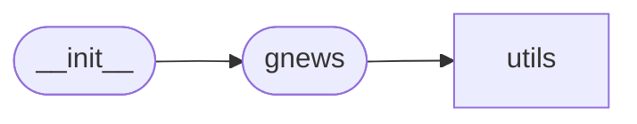

# Code Overview

[_Documentation generated by Documatic_](https://www.documatic.com)

<!---Documatic-section-Codebase Structure Python-start--->
## Codebase Structure Python

The codebase has a single-depth folder structure,
                with 5 code files in total.

<!---Documatic-block-system_architecture-start--->

<!---Documatic-block-system_architecture-end--->

# #
<!---Documatic-section-Codebase Structure Python-end--->

<!---Documatic-section-Key Objects-start--->
## Key Objects

There are exposed imports at level-0
from the source directory (gnews)

<!---Documatic-block-gnews-start--->

	
<code>gnews</code> (Click to Expand!)

* `gnews.gnews.GNews`

<!---Documatic-block-gnews-end--->

# #
<!---Documatic-section-Key Objects-end--->

<!---Documatic-section-Important Functions-start--->
## Important Functions

<!---Documatic-block-important_funcs-start--->
<!---Documatic-block-most_used_funcs-start--->
### Most Utilised Functions

* [gnews.utils.utils.connect_database](3-gnews_utils.md#gnews.utils.utils.connect_database) (1 times)
* [gnews.utils.utils.post_database](3-gnews_utils.md#gnews.utils.utils.post_database) (1 times)
* [gnews.utils.utils.process_url](3-gnews_utils.md#gnews.utils.utils.process_url) (1 times)
<!---Documatic-block-most_used_funcs-end--->

<!---Documatic-block-end_user_funcs-start--->
### End User Exposed Functions

* gnews.gnews.GNews
<!---Documatic-block-end_user_funcs-end--->
<!---Documatic-block-important_funcs-end--->

# #
<!---Documatic-section-Important Functions-end--->

[_Documentation generated by Documatic_](https://www.documatic.com)